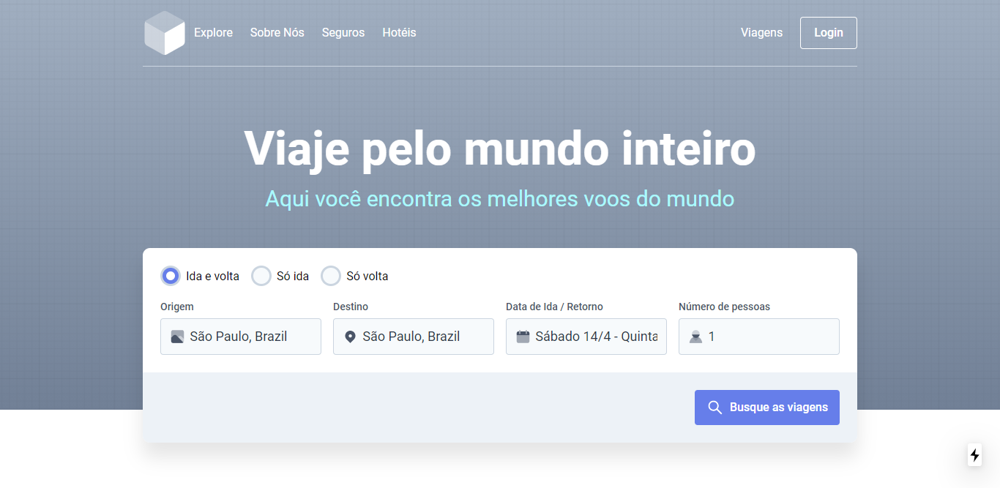

<h1 align="center">Teste de UI</h1>

	
	
	
	
	

## :computer: &middot; Projeto

Projeto desenvolvido baseado no desafio Front-end no Atados.

## :rocket: &middot; Tecnologias
Desenvolvido com:

- [Next.js](https://nextjs.org/)
- [Styled Components](https://styled-components.com/)

